# Instalación de Wordpress en servidor LAMP

### Instalo primero otros componentes de PHP que se necesitan:
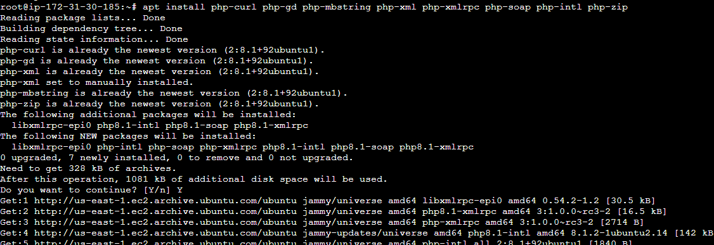

## Base de datos:
### Creo la base de datos...
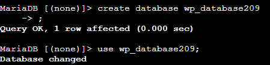

### Creo un usuario y le otorgo todos los permisos
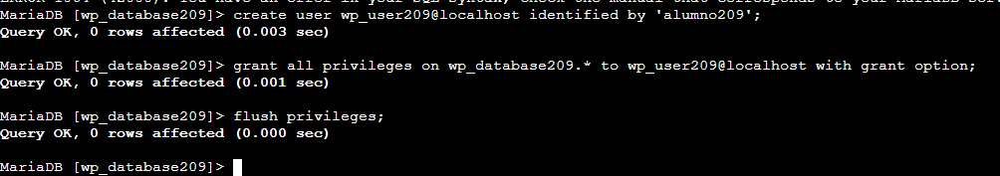

## Apache
### Voy a editar la configuracion del sitio por defecto para que quede así:
De esta forma habilito que el directorio tome la informacion de fuera
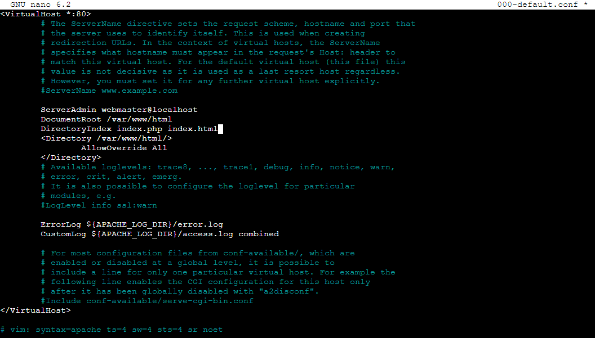

## Aquí activo el mod de Apache llamado rewrite para poder usar Permalink que es una funcion de Wordpress
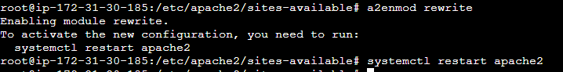

## Instalo Wordpress
### Mediante wget voy a descargar Wordpress
Descomprimo el paquete con unzip...
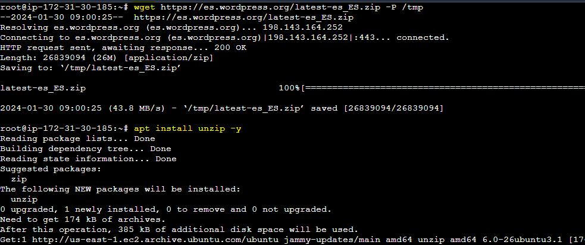

### Ahora muevo el contenido de `wordpress/` a `/var/www/html`
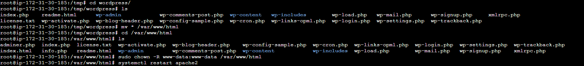

### Entro desde un navegador a la IP pública de la instancia EC2
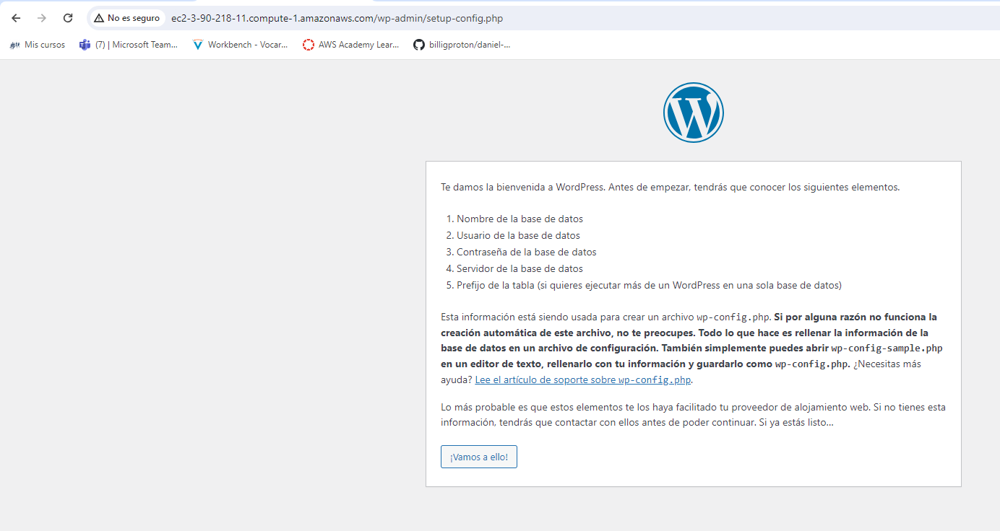

## Configuración de Wordpress:
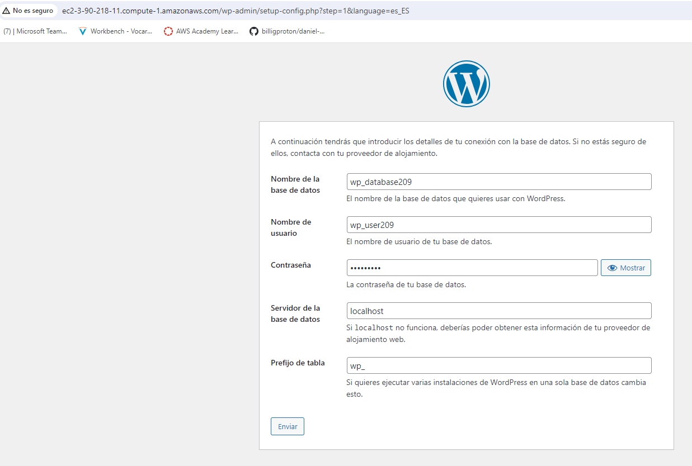

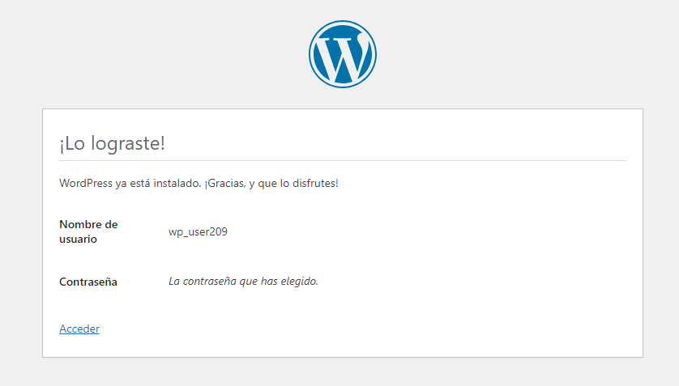

### Login...
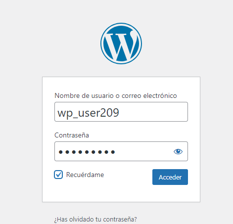

## Resultado
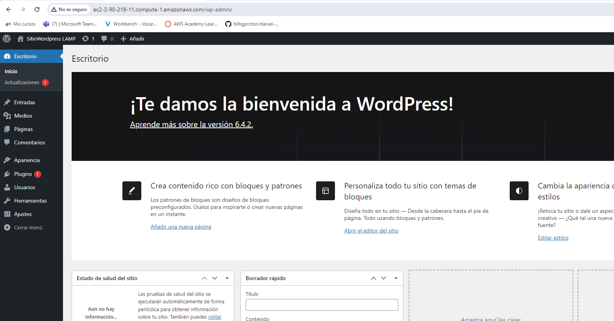
